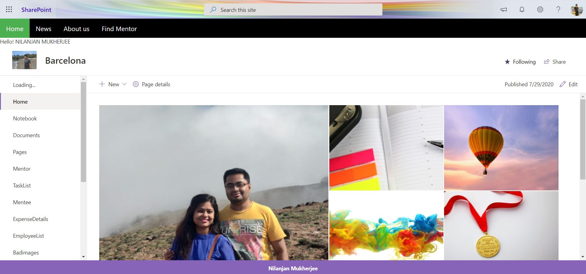

Navigation Bar In SPFx With Current User GreetingsShort summary on functionality and used technologies.

 
 
 
 For users having Read permission
 
  

We are using SharePoint extension to create a navigation bar. We are also rendering the greeting of current user.

Solution|Author(s)
--------|---------
Nilanjan Mukherjee

## Version history

## Disclaimer

**THIS CODE IS PROVIDED *AS IS* WITHOUT WARRANTY OF ANY KIND, EITHER EXPRESS OR IMPLIED, INCLUDING ANY IMPLIED WARRANTIES OF FITNESS FOR A PARTICULAR PURPOSE, MERCHANTABILITY, OR NON-INFRINGEMENT.**

---

## Minimal Path to Awesome

- Clone this repository
- Ensure that you are at the solution folder
- in the command-line run:
  - **npm install**
  - **gulp serve**

> Include any additional steps as needed.

